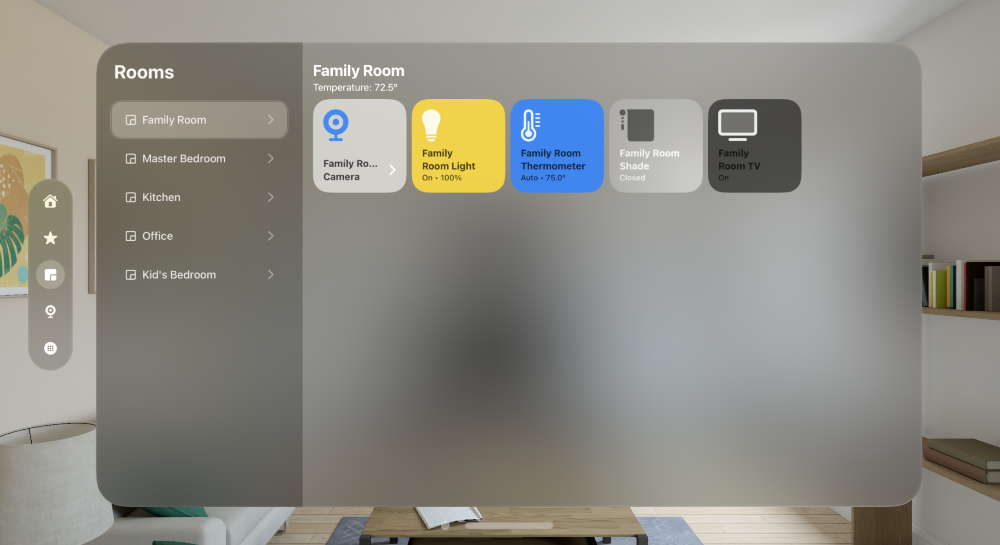
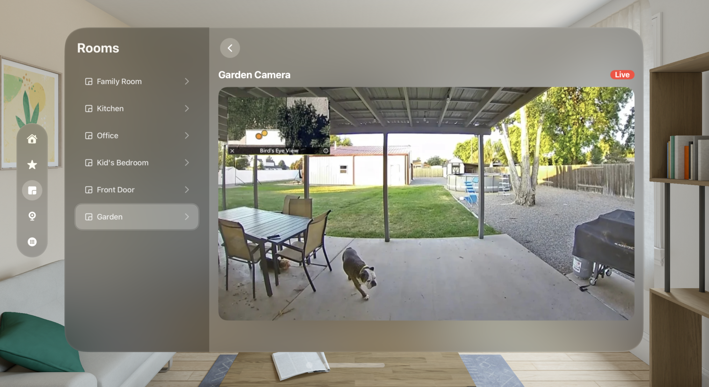

# VisionOS Smart Home App prototype for Apple Vision Pro
### Work in Progress...

  
  

## Overview

This repository contains a work in progress build for a native Smart Home application prototype designed for the Apple Vision Pro, showcasing the potential of a Smart Home app built on VisionOS. The project aims to demonstrate an intuitive user interface for controlling smart home devices within the Apple Vision Pro.

## Features

- **Device Control:** Easily manage and control various smart home devices such as lights, thermostats, and cameras.
  
- **Room Details:** Explore detailed information about each room, including temperature, device status, and specific controls.

- **Live Camera Feed:** Access live camera footage from supported devices, providing real-time footage within the app.

## Technologies Used

- **Xcode, VisionOS, Swift, SwiftUI**

## Contributing

Contributions are welcome! If you have ideas for improvements, feel free to submit pull requests or open issues.
