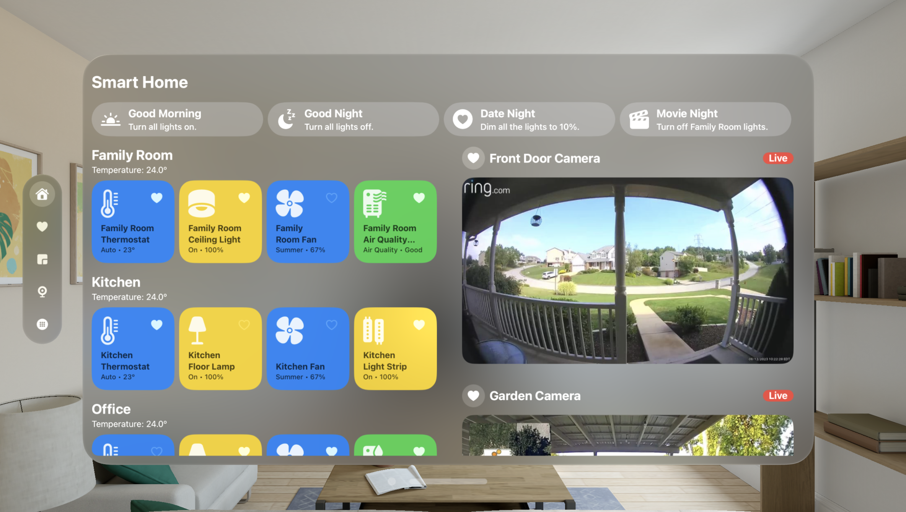
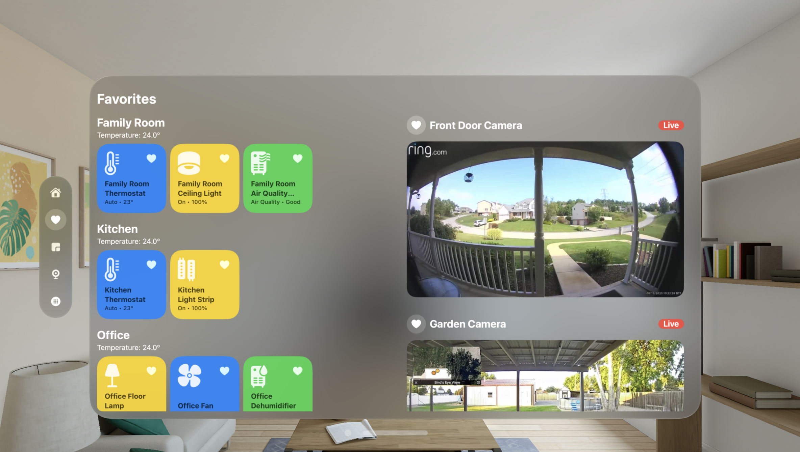
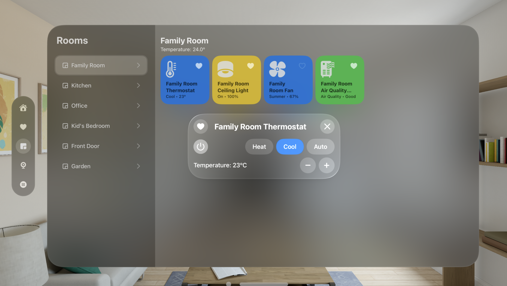
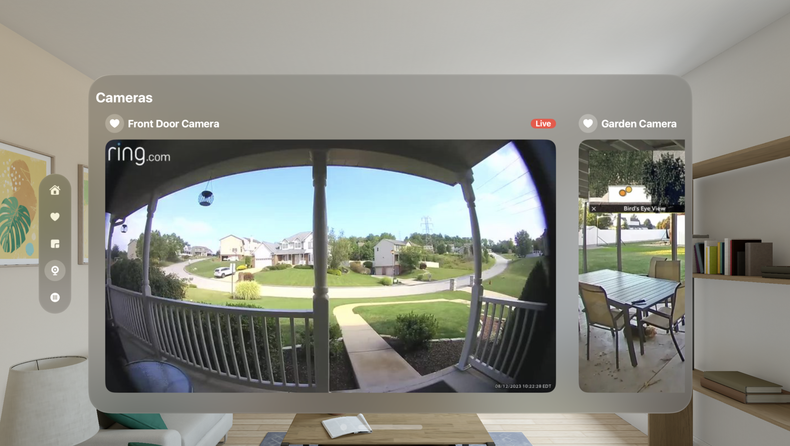
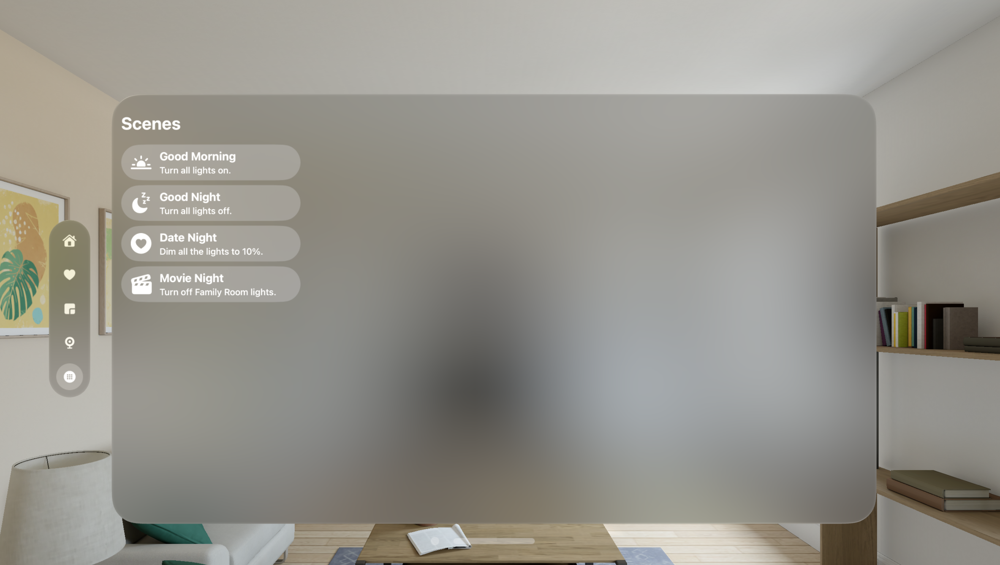

# VisionOS Smart Home App prototype for Apple Vision Pro

  <!-- Main Image -->
  

  <!-- Right Column -->
  

    

      
      
    

    

      
      
    

  

## Overview

This repository contains a build for a native Smart Home application prototype designed for the Apple Vision Pro, leveraging the power of spatial computing. It showcases the potential of a Smart Home app built on VisionOS and aims to demonstrate an intuitive user interface for controlling smart home devices within the Apple Vision Pro.

## Features

- **Device Control:** Easily manage and control various smart home devices such as lights, thermostats, and cameras.

- **Room Details:** Explore detailed information about each room, including temperature, device status, and specific controls.

- **Live Camera Feed:** Access live camera footage from supported devices, providing real-time footage within the app.

- **Favorites:** New! Favorite your frequently used smart home appliances for quick access via the Favorites tab.

## Technologies Used

- **Xcode, VisionOS, Swift, SwiftUI**

## Contributing

Contributions are welcome! If you have ideas for improvements, feel free to submit pull requests or open issues.
